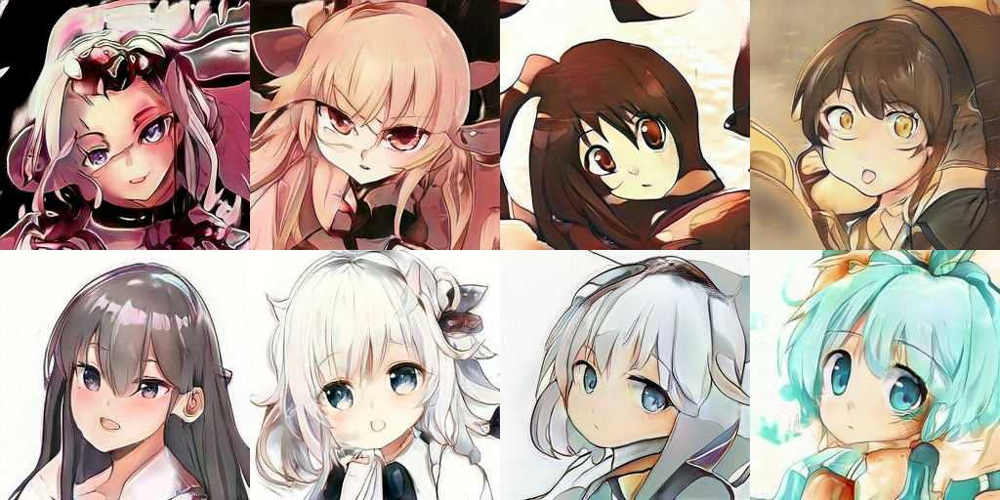
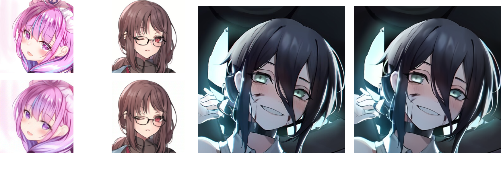
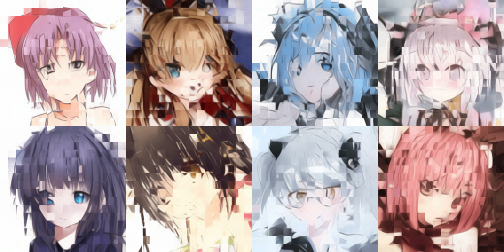

# Scratchpad

Minimal JAX library for generative models.

## Description

`scratchpad` is a minimal neural network library for generative models. It is built on top of [JAX]()
and [Equinox](). Its main goal is to provide a simple and flexible interface for neural network training in JAX.

## :battery: Features

1. Standard neural network layers
2. Flexible training loop
3. Data Distributed Parallelism
4. XLA JIT compilation
5. Mixed precision training
6. Differentiable augmentation
7. Pretrained models (CLIP, BERT, LPIPS, T5)

## :hammer: Implementations

I provide 4 classes of minimal implementations for generative models. All models were trained on TPUv3 cluster thanks to [TPU Research Cloud](https://sites.research.google/trc/) program. For more details on data and model training, please refer to the [technical writeup](https://re-n-y.github.io/devlog/rambling/anime2m/9).

### GAN



- [StyleGAN](https://arxiv.org/abs/1912.04958) [deprecated]
- [Differentiable Augmentation](https://arxiv.org/abs/2006.10738)

### Image Tokenizers



- [VQGAN](https://compvis.github.io/taming-transformers/)
- [ViT-VQGAN](https://blog.research.google/2022/05/vector-quantized-image-modeling-with.html)

### Diffusion Models


- [EDM](https://arxiv.org/abs/2206.00364)
- [DDPM](https://arxiv.org/abs/2105.05233)

### Autoencoding / Autoregressive



- [MASKGIT](https://arxiv.org/abs/2202.04200)
- [MAGE](https://openaccess.thecvf.com/content/CVPR2023/papers/Li_MAGE_MAsked_Generative_Encoder_To_Unify_Representation_Learning_and_Image_CVPR_2023_paper.pdf)
- [Parti](https://arxiv.org/abs/2206.10789)

## :books: Utilities

### RNG utilities

In JAX, `PRNGKey` is extensively used to control randomness. However, one has to invoke `jr.split` to generate multiple keys for different layers. This is not only tedious but also error-prone. `RNG` is a simple wrapper around `PRNGKey` that automatically splits the key for you.

```python
import jax
import jax.random as jr
from toolkit import RNG

key = jr.PRNGKey(42)

# without RNG
akey, bkey = jr.split(key)
jr.normal(akey, (42,))
jr.normal(bkey, (42,))

# with RNG
key = RNG(key)
jr.normal(next(key), (42,))
jr.normal(next(key), (42,))
```

### Distributed training and Mixed precision

`scratchpad` provides a simple interface for distributed training and mixed precision training. `ddp` fully JIT compiles the traning step. `gradients` and `parameters` automatically handles mixed precision training.

```python
import jax
import jax.numpy as jnp
import jax.random as jr
from functools import partial
from toolkit import RNG, gradients, ddp, parameters, replicate

key = jr.PRNGKey(cfg["seed"])
key = RNG(key)
dsplit = lambda key: jr.split(key, jax.device_count())

G = Decoder()

# perform bf16 training
grads = partial(gradients, precision="half")
optimisers = optax.lion(3e-4, b1=0.95, b2=0.98, weight_decay=0.1)
states = optimisers.init(parameters(G))

# replicate model and states across devices
G, states = replicate(G), replicate(states)

@ddp
def Gstep(G, batch, states, key=None):
    key = RNG(key)

    @grads
    def cross_entropy_loss(G, batch):
        bkey = jr.split(next(key), len(batch))

        logits = G(batch, bkey)
        labels = jax.nn.one_hot(batch, 8192)
        loss = optax.softmax_cross_entropy(logits, labels)
        loss = jnp.sum(loss)

        return loss, { "...": ... }

    (loss, metrics), gradients = cross_entropy_loss(G, batch)
    updates, states = optimisers.update(gradients, states, G)
    G = equinox.apply_updates(G, updates)

    return G, states, loss, metrics
```

## :wrench: Components

### Layers

#### Linear layers

```python
import jax
import jax.numpy as jnp
import jax.random as jr
from layers import Projection, Convolution, MLP
from toolkit import RNG

key = jr.PRNGKey(42)
key = RNG(key)

layer = Projection(128, 256, key=next(key))
mlp = MLP(128, key=next(key))
glu = GLU(128, key=next(key))
```

#### Convolutions

```python
from layers import Convolution, FocalModulation, MaxPool

key = jr.PRNGKey(42)
key = RNG(key)

convolution = Convolution(128, 256, kernel=3, padding=1, stride=1, groups=1, key=next(key))
focalmod = FocalModulation(128, window=3, level=3, factor=2, bias=True, dropout=0.1, key=next(key))
maxpool = MaxPool(window=2, key=next(key))
```

#### Normalisation layers

```python
from layers import Projection, Convolution, MLP
from toolkit import RNG

key = jr.PRNGKey(42)
key = RNG(key)

layernorm = LayerNorm(128, key=next(key))
groupnorm = GroupNorm(128, 4, key=next(key))
```

#### Activations

```python
from layers import Activation

gelu = Activation("gelu")
swish = Activation("swish")
tanh = Activation("tanh")
relu = Activation("relu")
```

#### Attention layers

```python
from layers import SelfAttention, CrossAttention, ParallelAttention

key = jr.PRNGKey(42)
key = RNG(key)

attention = SelfAttention(768, heads=12, dropout=0.1, causal=True, bias=True, key=next(key))
xattention = CrossAttention(768, 1024, key=next(key))
pattention = ParallelAttention(768, key=next(key))
```

#### Embedding layers

```python
from layers import Embedding, FourierEmbedding, SinusoidalEmbedding

key = jr.PRNGKey(42)
key = RNG(key)

embedding = Embedding(8192, 768, key=next(key))
fourier = FourierEmbedding(128, size=(256,256), key=next(key))
sinusoidal = SinusoidalEmbedding(8192, key=next(key))
```